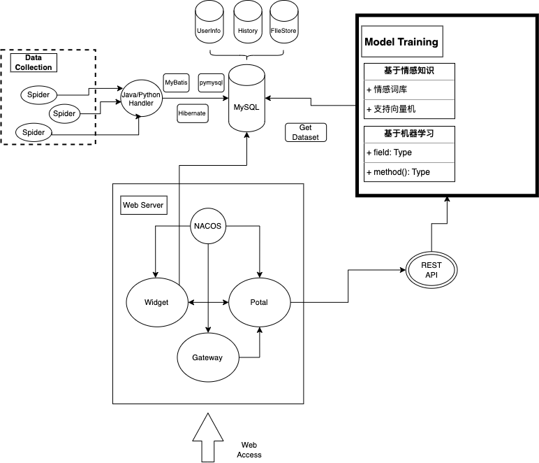

# SentimentAnalysis

使用python进行中文文本分析

---

# 架构

# 数据获取

本数据集是谭松博收集的一个大型中文酒店点评数据集。语料库大小为 10,000 条评论。语料库是从 Trip.com 自动收集和组织的。

数据来源：[IEEE](https://ieee-dataport.org/open-access/chnsenticorp)

该数据集分为 4 个子集，包括：ChnSentiCorp-Htl-ba-2000（平衡语料库，1000 篇文章用于正面和负面类别），ChnSentiCorp-Htl-ba-4000（平衡语料库，2000 篇文章用于正面和负面类别）， ChnSentiCorp-Htl-ba-6000（平衡语料库，3000 个正负类别）和 ChnSentiCorp-Htl-unba-10000（不平衡语料库，7000 个正类别）。